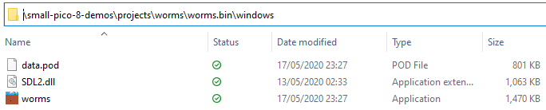

# small-pico8-demos
Code I have written appears in the .p8 file within each separate project's sub-directory. Automatically-generated binary files are also provided for multiple operating systems so that the programs can be run.

## Download (Windows):

To download and run a project file, navigate to the relative directory as follows:
 
*small-pico8-demos*\\*projects*\\*[name]*\\*[name]*.*bin\windows*

For example:

Make sure you have all three files downloaded (the .pod, the .dll, and the .exe) and in the same directory, and launch the .exe as normal.

## Notes:
* The default PICO-8 IDE has a very zoomed-in view that cannot be changed, thus many of my longer statements and comments are written across multiple lines for easier understanding whilst programming;
* PICO-8 omits a few features of Lua and provides a few extra shortcuts/functions of its own due to its primary role as a game development software;
* Letters in PICO-8 cannot be capitalised, and spaces/tabs provide the same amount of indentation within the IDE, which explains potential oddities in my code's presentation;
* Tabs are an IDE feature of PICO-8 that are used to visually segment the code. For readibility in the raw .p8 file, I emphasise each new tab with a title and multiple hyphens.
