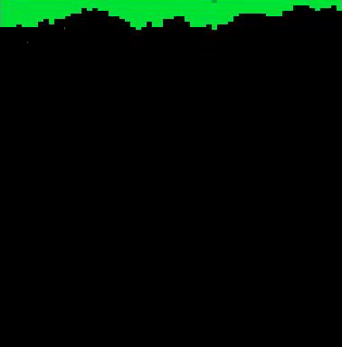

# slime
Animated graphic of viscous liquid.

## Preview:

## Notes:
* Built upon concepts in my rainbow-drips project;
* A brief experiment with PICO-8's in-built "time()" function (using the alias "t()");
* Replaced strict randomness in drip speed with drips that are viscous relative to their neighbours, and travel accordingly;
* Finished for now.